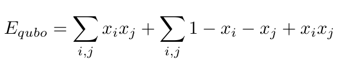

# MaxCut
A solution of the Maximum Cut problem on a DWave quantum annealer.

One possible statement of the Max Cut problem would be: "Given an undirected graph,
partition the vertices into two sets such that the number of edges joining
vertices in different sets is maximized." You could think of it as wanting
to cut the edges between unlike vertices and also wanting to maximize the
 number of cuts.  

## Running the Code
If you have a DWave [LEAP account](https://cloud.dwavesys.com/leap/), then open
this repository as a new [IDE workspace](https://ide.dwavesys.io/workspaces/) by
following the instructions listed or clicking this link:
[https://ide.dwavesys.io/#https://github.com/brettrhenderson/MaxCut](https://ide.dwavesys.io/#https://github.com/brettrhenderson/MaxCut). You can run the code directly in this IDE by
opening the maxcut.py file and clicking the small green arrow in the top right
of the IDE.

## Examples:
In this script, we set up the Max Cut problem to be solved on a DWave QPU using
the Ocean SDK. Two graphs are defined in the script, and you can toggle between
which problem you are solving by commenting/uncommenting the graph you want,
or by defining your own. The first example is taken from the DWave Slides
in the Introduction to Quantum Computing Models put on by TRIUMF in
July - Aug 2020.

It solves for the following graph, and returns the solutions below it. Each
solution comes in a pair, where the colors are simply reversed, for a total
of 8 lowest energy solutions that contain 6 cuts.

<center>
 
</center>

I made another simple example just to show that the script can handle an
arbitrary input graph. The left-hand graph has two lowest-energy solutions
corresponding to the partitioning on the right.

<center>
 
</center>

## Defining a graph
Since our graphs are undirected, we can define them simply by creating a set
of the edges, written as tuples of the vertex names. For example, the second
graph above is defined as

```python
graph = {('A', 'B'), ('A', 'C'), ('B', 'C'), ('B', 'D'), ('B', 'E'), ('C', 'D')}
```

The vertex names can be strings of any length.

## Solution
To derive a solution to the Max Cut problem, I followed the steps outlined by
DWave in the Introduction to Quantum Computing Models put on by TRIUMF in
July - Aug 2020:
1. Write out the objective and constraints in plain words.
    - We can use the problem definition above to say that our objective is to
    maximize the number of edges between vertices in different sets.
    - There are no constraints.
2. Define binary variables.
   - We define a binary variable x<sub>i</sub> for each vertex in the graph.
   If the variable takes value 0, we say that it belongs to one set, and if it
   takes value 1, it belongs to the other set. That is

   <center>
    
   </center>

3. Write objective in mathematical form.
   - We need to write the objective in such
     a way that edges in the same set increase the energy. Since we care about edges
     here, or the relationships between our variables, let's look at how to write our
     interaction terms. Let's write the interaction terms in such a way that
     when both variables are 0 or both variables are 1, we have an increase in
     energy, but no increase for variables that are 0 and 1 or 1 and 0.

     <center>
      
     </center>

     Where the sums run over all existing edges between vertices i and j. Notice
     that terms in the first sum are 1 when both x's are 1, and terms in the  
     second sum are 1 when both x's are 0. All terms are 0 when x's are not equal.
     Since all edges are equally valued, we can set all of the biases to 1, giving

     <center>
      
     </center>

     Now we can simplify by multiplying out the right hand sum.

     <center>
      
     </center>

     Joining the two sums and combining like terms, we have

     <center>
      
     </center>

     Since we can't encode constant energy offsets in the DWave framework, we
     can drop the constant, giving us the final form of the objective

     <center>
      
     </center>

     Where we remember to only sum over the i, j combinations for edges that
     actually exist in the graph.

4. Write constraints in mathematical form.
    - There are no constraints.
5. Combine objective and constraints.
    - This is the same form for the energy at the end of item 3, above. We can
    write this as a Q dictionary that can be read by the Ocean SDK (see [code](maxcut.py)).
6. Solve, and interpret results.
    - The solutions are printed as a list of binary strings and associated scores.
    A variable 'x*NodeName*' corresponds to each node. A value of 0 means it is in
    the first set of the partition, and the value 1 means it is in the second set.
    When running the code on the two graphs shown in [examples](#examples), we
    obtain the solutions shown, where red vertices are in one set and white are
    in the other. When sampling the QUBO, we also obtain a small population of
    higher-energy solutions.
7. Tune the QUBO to get better results.
   - I noticed that I obtain more high energy solutions when using a relatively
   high chain strength parameter when sampling the QUBO. In general chain_strength
   should be set to about the same magnitude as the largest bias on any of the
   nodes. Looking at our objective function, we see that this ends up being the
   number of edges emanating from the most connected vertex in the graph. For both
   of the example graphs, this is 4, and setting the chain strength to 4 or 5
   seems to yield a good proportion of the correct lowest energy solutions.  
